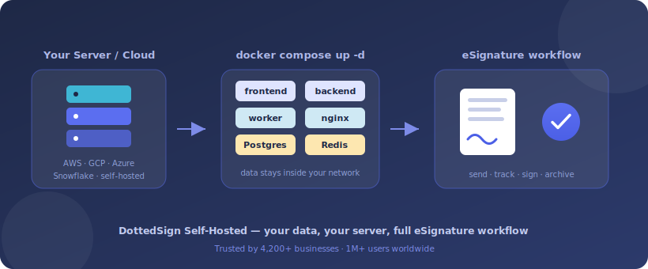

[English](./README.md) | [繁體中文](./README.zh-TW.md)

# 點點簽 DottedSign Self-Hosted：企業級私有化部署電子簽章系統

[](./LICENSE) 

*Self-host DottedSign with Docker Compose — your data, your server.*



**已服務全球超過 4,200 家企業、突破 100 萬用戶。** 點點簽 DottedSign Self-Hosted 讓重視資料主權的企業，在自有網路環境或常用雲端中，自主運行完整的點點簽簽署系統。專為有合規需求或封閉網路環境的組織打造，提供一套你能完全掌控的彈性電子簽署流程。

## 核心特色

- 資料主權：文件與簽署紀錄留存於企業自有伺服器，不經第三方基礎設施。誰能存取、保留多久，全由你決定。
- 支援 Docker 部署：提供 Docker Compose 安裝流程，協助 IT 人員快速完成環境建置與概念驗證 (POC) 測試
- 免費開源版體驗：本開源版本提供永久授權使用，包含基本簽署功能與 API 核心模組，支援無限制的簽署次數與用戶數（註：此版本完成之簽署文件將帶有免費版識別標示）
- 彈性部署：同一套 Docker Compose，環境由你選——自有伺服器，或你已在使用的雲端（AWS、GCP、Azure、Snowflake）。在不同環境間移動，運行方式都一樣。


## 快速開始 (Quick Start)

### 系統環境需求 (Prerequisites)：

- Docker 20+
- Docker Compose v2
- 建議 8 GB RAM（涵蓋 Postgres、Redis、backend、worker、frontend、nginx 全套服務）

### 步驟 1：Clone 專案

```bash
git clone https://github.com/DottedSign-Official/dottedsign-self-hosted.git dottedsign-self-hosted
cd dottedsign-self-hosted
```


### 步驟 2：設定環境變數

請複製 `backend.env.sample` 並更名為 `backend.env`，根據您的環境進行設定

```bash
cp backend.env.sample backend.env
```

可完整參考（每個變數、預設值與是否必填）位於
[`docs/configuration.md`](./docs/configuration.md)。

啟動服務的必填變數：

| 變數 | 用途 |
| --- | --- |
| `DATABASE_HOST` / `DATABASE_PORT` / `DATABASE_NAME` / `DATABASE_USERNAME` / `DATABASE_PASSWORD` | PostgreSQL 連線 |
| `REDIS_HOST` | Redis 連線 |
| `SERVER_HOST` / `WEB_BRANCH_DEEPLINK` | 對外服務 URL |
| `JWT_SECRET` | JWT 簽章金鑰 |
| `OTP_KEY` | OTP 金鑰 |
| `SUPER_ADMIN` / `SUPER_ADMIN_PASSWORD` | 初始超級管理員 |
| `MEMBER` / `MEMBER_PASSWORD` | 初始一般使用者 |


### 步驟 3：啟動服務

```bash
docker compose up -d
```
服務啟動後，即可透過瀏覽器造訪 `http://127.0.0.1` 或 `http://{env.host}` 開始使用 DottedSign

預設帳號可至 `backend.env` 確認

在將服務暴露至 localhost 以外的網路前，請務必更換所有預設帳密。


### 其他技術文件

- [OpenAPI README](./openapi/README.md) —— API 規格與本機預覽
- [Configuration Reference](./docs/configuration.md) —— 完整環境變數

## **API 整合情境**

**API 串接，嵌入您的內部系統**

DottedSign Self-Hosted 提供完整的 REST API，讓 IT 團隊可以將電子簽名流程嵌入企業既有的業務系統，無需使用者切換平台。

**常見整合情境**

| 部門 | 情境範例 |
| --- | --- |
| 法務 | 法務合約審閱完成後，自動觸發簽署流程，雙方線上完成用印 |
| 採購 | 採購系統送出 PO 單後，串接 API 發起供應商電子簽核 |
| 旅遊 | 訂單成立後自動產生保險合約並寄送給客戶簽署 |
| 人資 | 新進員工到職當天，HR 系統自動發送報到文件包（勞動契約、保密協議等） |

透過 API，您可以：
- 發起簽署任務：指定簽署人、欄位位置、到期時間
- 即時追蹤狀態：掌握每份文件的簽署進度
- 自動歸檔：簽署完成後自動取回 PDF，存入您的文件管理系統


## Self-Hosted 還是 SaaS？哪個適合你

兩者跑的是同一套 DottedSign 簽署體驗，差別在於**資料放在哪、由誰維運**。

| | Self-Hosted（本專案） | SaaS |
| --- | --- | --- |
| 資料存放位置 | 自有伺服器——內網，或你常用的雲端平台（AWS／GCP／Azure／Snowflake） | DottedSign 託管的雲端 |
| 適合誰 | 有資料主權／合規需求、封閉網路環境的組織 | 立刻開始簽署的團隊 |
| 部署方式 | 自行以 Docker Compose 部署 | 免部署，註冊即用 |
| 維運與更新 | 由你的 IT 團隊負責 | 由 DottedSign 負責 |
| 授權 | 開源 AGPL-3.0（永久授權）；另有商業授權 | 訂閱制方案 |
| 進階安全模組 | 透過商業授權提供（如經認可的數位憑證、Email／簡訊 OTP） | 依方案內含 |

不確定哪個適合？[聯繫點點簽團隊](https://www.dottedsign.com/zh-tw/request-demo/)。

## 常見問題 FAQ

### 開源版真的免費嗎？

是的。本開源版採 AGPL-3.0 永久授權，包含基本簽署功能與 API 核心模組，支援無限制的簽署次數與用戶數。此版本完成的簽署文件會帶有免費版識別標示。

### 除了自有伺服器，可以部署在雲端嗎？

可以。同一套 Docker Compose 既能跑在企業內網，也能部署於你常用的雲端平台——AWS、GCP、Azure、Snowflake。

### 開始前需要準備什麼？

Docker 20+、Docker Compose v2，建議 8 GB RAM（涵蓋 Postgres、Redis、backend、worker、frontend、nginx 全套服務）。詳見上方快速開始。

### 開源版與商業授權差在哪？

開源版涵蓋核心簽署作業流程；商業授權可解鎖進階安全模組（如經認可的數位憑證、Email OTP、簡訊 OTP）、透過組織權限管理控制台（Admin Console）設定成員角色與權限，並支援深度整合／客製化，且不受 AGPL-3.0 開源規範限制。

### 只在內部使用，也要受 AGPL-3.0 約束嗎？

若僅於組織內部安裝使用，未對外散布、亦未透過網路對外提供服務予第三方，則不受開源條款的強制影響。若修改原始碼並對外提供服務予第三方，依約定須將修改後的原始碼以 AGPL-3.0 開源。有不開源的客製化需求，建議洽詢商業授權。

### 怎麼取得技術支援？

部署問題歡迎於 GitHub Issues 提出，由社群協助。授權客戶享有比照 SaaS 標準的 SLA 支援服務——詳情請[洽業務團隊](https://www.dottedsign.com/zh-tw/request-demo/?help=inquiry_enterprise_plan)。


## **企業導入實績與案例**

點點簽 DottedSign 累積豐富的企業服務經驗，提供尋求 Self-Hosted 方案的企業技術合規與穩定性的參考：

- **市場實績**：全球已服務超過 4,200 家企業，全球突破**百萬用戶**導入。
- **大型製造業**：推動 ESG 無紙化，數位簽章加速內部合規流程。
- **跨國旅遊集團**：旅遊合約數位化，打造低碳簽署體驗。
- **大型金融證券**：導入視訊電子簽章，開展金融科技新應用。
- **零售 / 連鎖集團**：每年超過 1,000 份人事文件全面無紙化。
- **科技上市企業**：完善對外電子化商務流程。
- **知名旅遊電商**：結合 RPA 自動化，招募合約 1 天內有效簽回。

👉 [查看更多客戶故事](https://www.dottedsign.com/zh-tw/blog/category/client-story)

## 進階需求與商業授權
目前的開源版本涵蓋了核心的簽署作業流程。若您的組織有以下進階需求：

1. 解鎖進階安全模組：如經認可的數位憑證、Email OTP、簡訊 OTP 等功能
2. 專屬客製化與系統整合：需要對系統進行深度整合，或不希望受限於 AGPL-3.0 的開源規範

👉 歡迎聯繫 [點點簽業務專人服務](https://www.dottedsign.com/zh-tw/request-demo/?help=inquiry_enterprise_plan) 洽詢商業授權方案與報價

## AGPL-3.0 開源授權與注意事項
本開源版本基於**AGPL-3.0 條款**發佈
- 若您的組織僅於內部安裝使用，未對外散布、亦未透過網路對外提供本系統服務予第三方，將不受開源條款的強制影響
- 若您修改了系統原始碼（例如調整介面），並將修改後的系統對外提供服務予第三方，則依約定必須將修改後的原始碼一併以 AGPL-3.0 開源。如有不開源的客製化需求，建議洽詢商業授權

## 技術支援 (Support)
- 開源版技術討論：如遇部署技術問題，歡迎於 GitHub Issues 提出，由社群共同交流與協助。
- 商業授權與服務支援：授權客戶享有比照 SaaS 標準的 SLA 支援服務，詳情請洽業務團隊。